# CAGR: Point-to-Point Annualized Returns

## Intro 

So far, we’ve covered various computations, which mostly involved algebraic sum / multiplication / subtraction.

Except, these aren't enough.

We need to add new tools in our arsenal to fully unlock the powers of excel, to aid with our day-to-day financial decision-making process.

Learning about CAGR is only the first step towards that.

## CAGR 

CAGR \(**C**ompound **A**nnual **G**rowth **R**ate\) is a measure of how _fast_ a value has been growing, assuming this value is probably a result of a compounding process.

Let's assume value at the beginning of a time period was $$V_{initial}$$, and if it changed to $$V_{final}$$ over a period of time $$t$$, then CAGR or the rate of this growth, can be formulated as:

$$V_{final} = V_{initial}(1 + r/100)^t$$

Where, $$r$$ is the **annualized rate of growth** or CAGR.

This is a well known formula for calculating compound interest and we've been taught this back in school.

Rearranging this equation for $$r$$, we get

$$r = 100((\frac{V_{final}}{V_{initial}})^{1/t} - 1)$$


In the above formula, $$r$$is greater than 1. If we want the value of $$r$$ to be between 0 and 1 \(and not 0 and 100 as is usually expressed in percentage notation\), we can remove multiplication by 100 from the formula. Either choice is fine.


Let's see how we can use this in the real world of investments.

## 3Y Return CAGR

A common use of CAGR is to compute returns of a mutual fund or a stock portfolio watchlist \(e.g. Smallcase\).

Let's begin with a common one: 3 year \(often written as **3Y**, for short\) return of a mutual fund.

Most mutual fund platforms report annualized returns for time periods greater than 1 year, while absolute percentage growth for time periods smaller than 1 year.

It's an accepted norm.

At exact 1 year mark, either can be reported, since both would be same \(annualized and absolute _return_\).  
  
Returns above 1 year, are reported as _annualized rate of growth_, often appended with _per annum_ \(**p.a.**, for short\).

We know that index funds track the index. In rest of this chapter, we'd compute and compare CAGR of Nifty, and that of a Nifty index fund over an arbitrary period of time.

From ValueResearch Online, [UTI Nifty Index Fund Direct Growth](https://www.valueresearchonline.com/funds/15830/uti-nifty-index-fund-direct-plan) \([archive.org link](https://web.archive.org/web/20210122010723/https://www.valueresearchonline.com/funds/15830/uti-nifty-index-fund-direct-plan) \| [archive.is link](https://archive.is/zSHxj)\) has 3Y return of **13.72% p.a.**, as on **26th Mar 2021**. Exact date is important, since this 3Y return value would change with date.

Notice the value under **3-Y** column, noted as **13.72**.

This is effectively 3Y CAGR of the fund. It means, as on 26th March, 2021; 3 year CAGR of this fund was 13.72% p.a.

Our task would be to do these:

* validate this number, computing it ourselves
* compare against CAGR of Nifty over same time period

### Validating Fund 3Y CAGR

We need historical NAV data for this.

One way we can obtain it via Google Finance. Ticker symbol for UTI Nifty Index Direct Growth is `"MUTF_IN:UTI_NIFT_INDE_1HPGBNK"`.

Another option would be to use the AMFI endpoint for latest NAV, and ISIN of this fund to lookup the latest NAV, as we've discussed in a previous chapter.

But remember that CAGR needs only two data points. In this case, since we only need two data points, we can just manually look it up. And enter these two data point values into our excel sheet or spreadsheet manually.

Steps to follow:

* Head over to AMFI historic NAV page URL: [https://www.amfiindia.com/net-asset-value/nav-history](https://www.amfiindia.com/net-asset-value/nav-history)  This is different from other AMFI links / URLs we've seen in the past. It's a dedicated URL, where AMFI offers the user an option to select date range, fund name etc.; and receive NAV of a given fund between those two dates, both inclusive. 
* Search for dates around 26th March, 2021 \(select two dates, that are less than 90 days apart, and covers the given date\); we find the latest NAV as **96.7892** for UTI Nifty Index Direct Growth.  You could, for instance, select 1st March 2021 as one date, and 31st March 2021 as second date. These two dates are less than 90 days apart, and has the given date in its range. 
* Enter these info in a freshly created spreadsheet as follows:

  | Date | NAV |
  | :--- | :--- |
  | 26/03/2018 | 65.7954 |
  | 26/03/2021 | 96.7892 |

* Spreadsheet doesn't have an in-built `CAGR()` function, but we can make do with `RRI()` function for now \(we'd see better options in a later chapter\).  [Documentation for RRI function](https://support.google.com/docs/answer/9368238?hl=en) \| [archive.org link](https://web.archive.org/web/20200807053259/https://support.google.com/docs/answer/9368238?hl=en) \| [archive.is link](https://archive.is/u3SsD)  Invoke it as  `RRI(   3,   <cellID for value from 3 years ago>,    <cellID for value as on today> )`

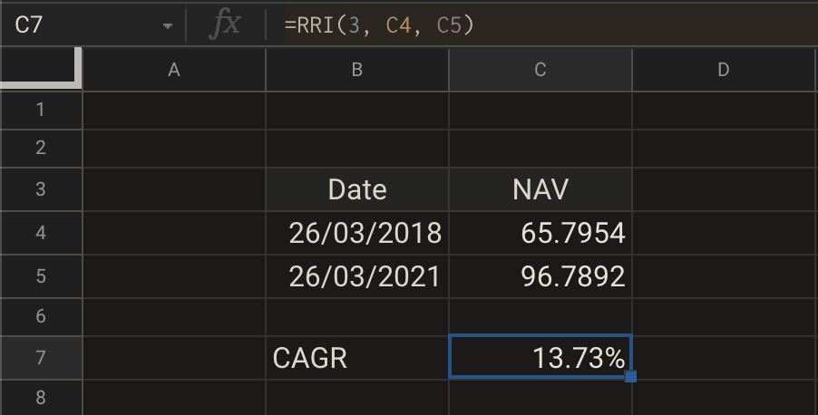

But instead of using the `RRI()` function, we could directly use the mathematical formula as we'd discussed above: $$V_{final}$$being the value on given date, $$V_{initial}$$ is the value on given date 3 years ago; and $$t$$ is 3, for 3 years.

We'd get this

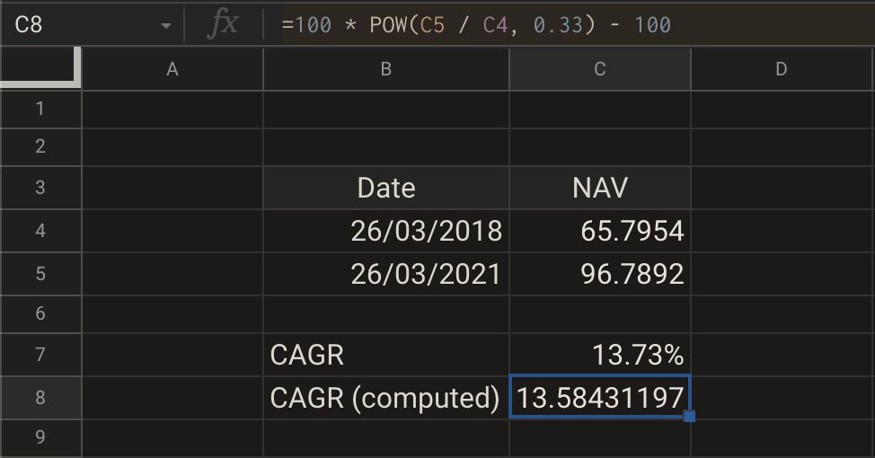

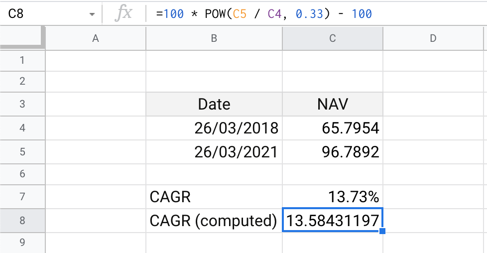

Notice that we've used 0.33 for $$1/t$$, to denote $$t = 3$$. This is **not** correct. We could get more accurate estimation, directly using $$1/3$$ instead of using 0.33.

However, the number of days between any two arbitrary dates cannot always be expressed as whole number of years. It might have leap-years, for example.

We see that computed value of **13.58%** is quite close to **13.72%** as reported, but we are not quite there yet.

On the other hand, growth rate computed using in-built formula is close to the reported value of 3Y return on ValueResearch Online portal.


Based on today's date, you might get a different value of latest NAV. You should use 3Y return as on today, and search for NAV as on dates near today's date, or dates from 3 years ago.



At the time of writing this, AMFI historic NAV provides NAV data on a maximum of 90 day period, at once. If you're searching for NAV for a particular date, adjust the start date and end date in a way, that would select any 90 day or smaller duration window, which covers that particular date.


We've used `GOOGLEFINANCE()` to prepare this video for guidance





### Cross-checking Nifty 3Y CAGR

Now that we've verified CAGR of the index fund over 3 years, independently, and matched with reported CAGR on an aggregator portal, it's time to compare with Nifty CAGR over same period.

Once again, we can use `GOOGLEFINANCE()` for getting historic Nifty price data. The ticker for Nifty can be `"NIFTY_50"` or `"INDEXNSE:NIFTY_50"`.





Final results as it can be

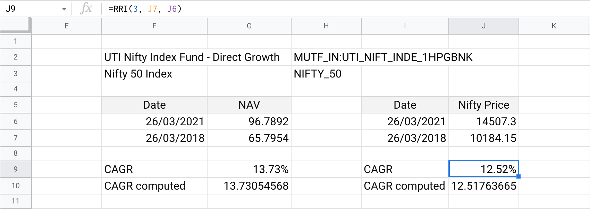

As you can see from this computation, the CAGR numbers of UTI Nifty Index Fund Direct Growth and the CAGR numbers for Nifty itself **do not match**.

In fact, this has nothing to do with the dates. You could select a different set of dates, 3 year apart and the return from Nifty Index fund would be slightly higher than Nifty 3Y CAGR.

In this case, 3Y CAGR as on 26th March 2021 is 13.73% p.a. for UTI Nifty Index Direct Growth. However, for Nifty itself, it’s slightly lower — 12.52% p.a.

This is expected!

An index fund tracks the TRI \(**T**otal **R**eturn **I**ndex\), and not the vanilla price index.

TRI is price index + dividends. When a listed business announces dividends, it has to subtract the _dividend per share_ from its share price. This is a reduction in fair market price of a share, that has nothing to do with the market forces.  
  
Nifty TRI can be thought of as an answer to this query: _what if we added the dividend-per-share values back to the share prices of respective Nifty companies, and recomputed Nifty?_

Therefore, over any given period of time

* Nifty index funds can have slightly higher return than Nifty itself.
* If no dividends were announced by any of the companies in Nifty index, in that time period, it can be expected that Nifty index fund CAGR would be close to that of Nifty CAGR itself.
* As time periods get longer \(10Y / 15Y / 20Y\), this difference becomes more and more stark between CAGR of Nifty and a Nifty index fund.

These have nothing special to do with Nifty itself. If you’d instead picked an S&P500 index fund, or a NASDAQ index fund - similar observations would’ve held true.

We can satisfy our curiosity, by comparing against Nifty TRI CAGR.

### Nifty TRI 3Y CAGR

Similar to last two computations, we just have to switch the ticker.

Except, to the best of our knowledge, Google Finance has **no ticker for Nifty TRI**.

In other words, we’ve to manually find and enter these values in our sheet, to compute CAGR.

We can obtain these from official NSE India website for historic data on TRI: [https://www1.nseindia.com/products/content/equities/indices/historical\_total\_return.htm](https://www1.nseindia.com/products/content/equities/indices/historical_total_return.htm)

Plugging in values for the two dates manually, and computing as earlier, we get this

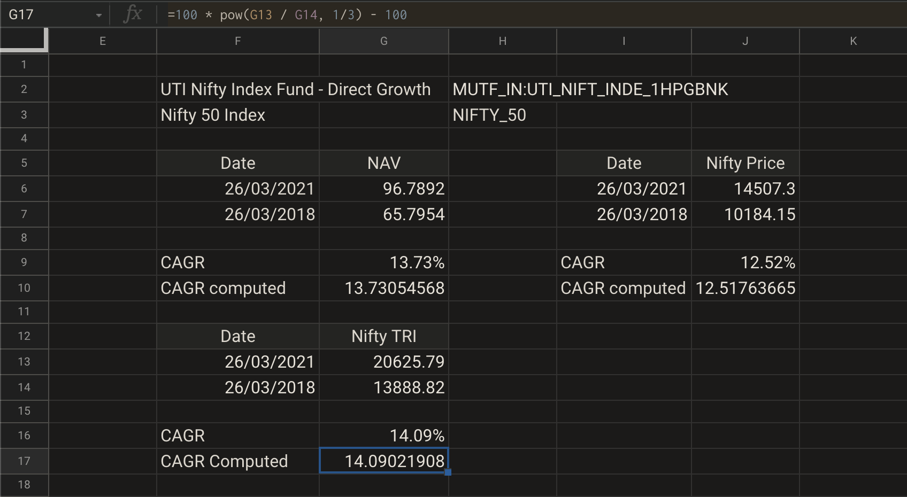

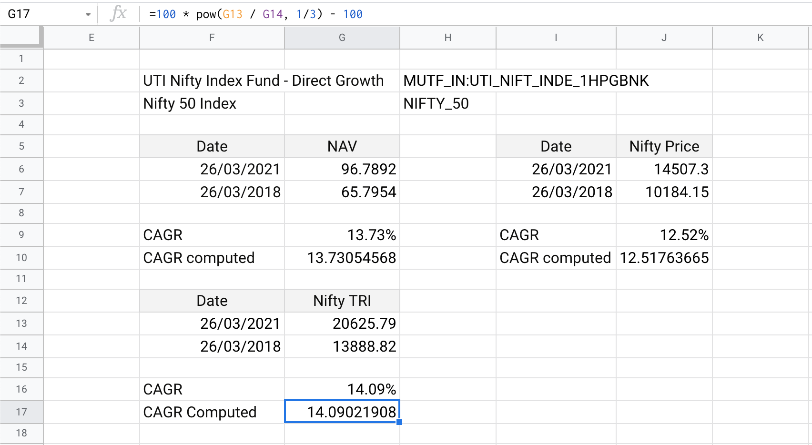

3Y CAGR of Nifty TRI, as on 26th March 2021, stands at **14.09% p.a.**

This is much closer to the CAGR of UTI Nifty Index - Direct Growth.

However, the CAGR is slightly higher.

An index fund is _supposed to_ mimic and replicate the TRI, but there can be inefficiencies. Hence, CAGR over a given period can be somewhat different in practice, with some _**tracking error**_.

We won’t discuss tracking error in detail here. But we’d emphasize tracking error can be both positive and negative in value.

In other words, due to inefficiencies in tracking the index, the CAGR of the index fund can be both higher or lower than CAGR of the TRI, over any given period.

## Visualization

Let's recall the original mathematical equation that we'd written above

$$V_{final} = V_{initial}(1 + r/100)^t$$

To build a mental model of what this formula means, in below diagram, we can plot value against time. Value can be price of an asset, based on our context and use-case.

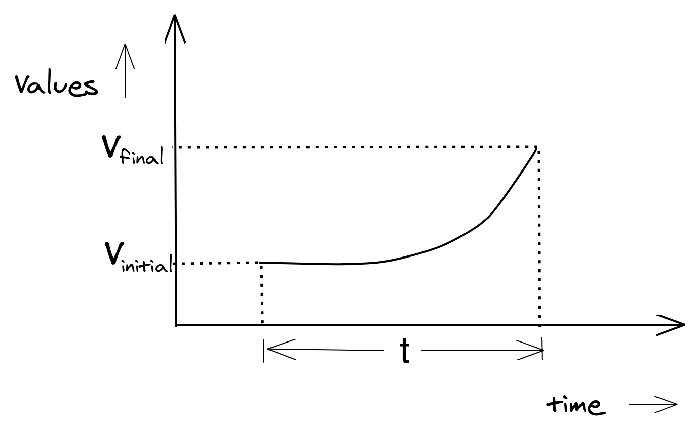

Value can be price of an asset, based on our context and use-case.

Notice that the growth doesn’t have to _look like_ compounded growth. It's the other way around - we can _model_ it or _think of it_ as compounded growth.

This mathematical formula, just needs two values:

* $$V_{final}$$
* $$V_{initial}$$

And on top of that, time it took to go from $$V_{initial}$$ to $$V_{final}$$

In fact, either of these two points in the Y-axis could be smaller / bigger than one another, or even be negative.

**The mathematical formula above poses no restrictions on that front**.

However, in the above graph, we’ve no way of visualizing or placing $$r$$, the rate of growth \(CAGR\).

It’s a power-law formula.

### Semi-log Plots

Instead of plotting value vs time, we can plot **logarithm of value** against time.


Discussing logarithm in detail, is out of scope for our wiki. However, if you'd like to brush up on basic logarithms, we highly recommend checking out this [YouTube video by 3Blue1Brown](https://youtu.be/cEvgcoyZvB4?t=326)


Note that we can take $$\log$$ of expressions on both sides of the equation **only if both sides are positive numbers**.


Logarithm, or $$\log$$ for short, cannot be used on negative numbers — it results in _complex numbers_, which we don't need to deal with in context of investments and finance.


In the above equation, taking $$\log$$ on both sides, we get

$$
\log(V_{final}) = \log(V_{initial}(1 + \frac{r}{100})^t)
$$

We can use logarithmic identities \(left to reader as an exercise, we won't show detail computation for that here\) to arrive at the following formula

$$
t \log{(1 + \frac{r}{100})}  = [\log {V_{final}} - \log {V_{initial}}]
$$

This is effectively the straight line equation, similar to $$y = mx + c$$. In this scenario, $$t$$is effectively the X-axis, while Y-axis is $$\log{V}$$.

We can now update our diagram's Y-axis.

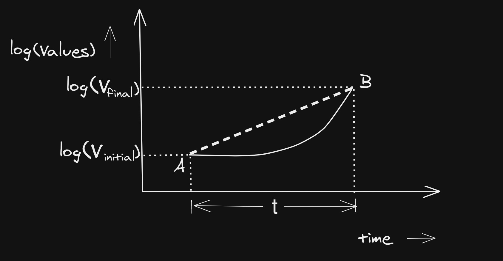

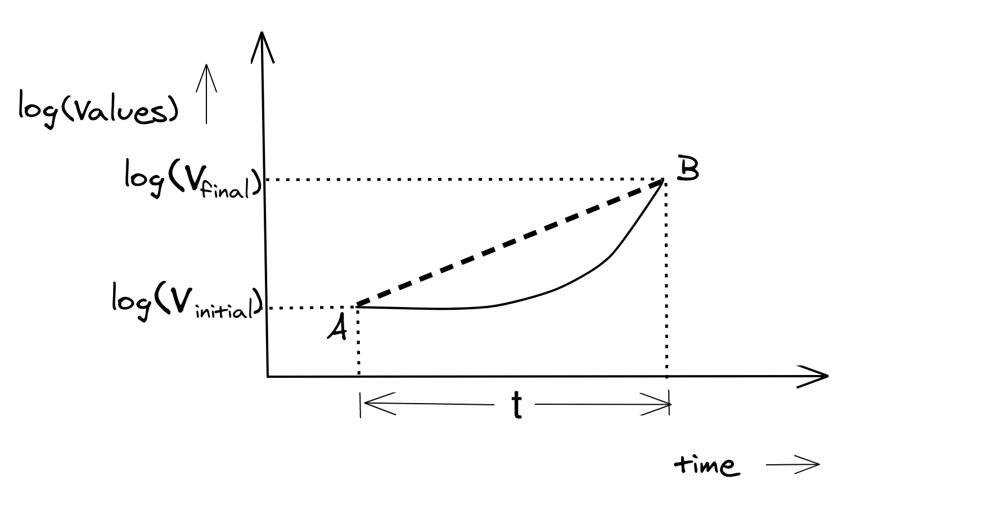

We have plotted $$\log$$ of values \(Y-axis\) versus time \(X-axis\). Then we've joined the start point and end point with a dotted straight-line.

The _slope_ of a straight line joining those two points $$A$$ and $$B$$, is $$\log{(1 + \frac{r}{100})}$$, and can be used to compute $$r$$.

CAGR directly relates to slope or tilt of a straight line joining two points, in a semi-log plot of asset prices. If slope is known, $$r$$can be computed; and vice-versa.  
  
Also, higher and lower slope of the joining straight line correspond to higher and lower values of $$r$$, respectively.

We shall now plot these price points in a graph where price values are logarithmic, and try to validate that our visual idea about CAGR holds true.


Since the Y-axis is in log scale, but X-axis is in normal scale; such plots are called _semi-log plots_. For it to be a log plot, both X and Y axes have to be in log scale.


Spreadsheets have fantastic charting / plotting abilities built in. You could use the Charting button on toolbar, or just select an area of cells which has data, then use `Insert` →`Chart`

Refer to this video on how to get this working





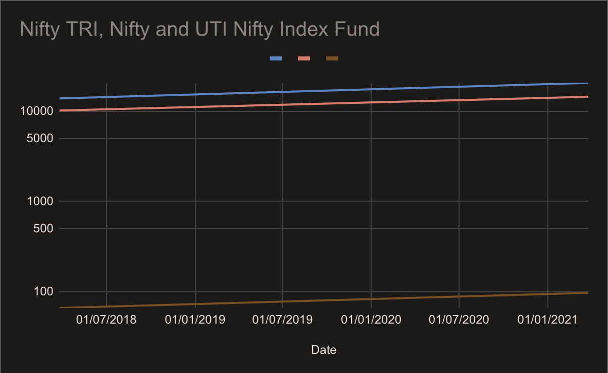

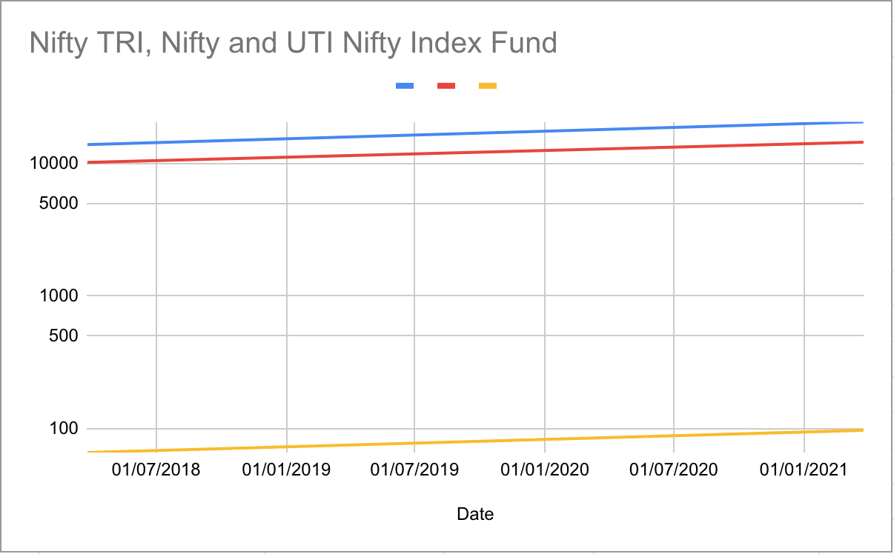

We see from the videos / images above, that once we switch the Y-axis to logarithmic values, the three lines start to look parallel to each other.

Parallel lines have same slope, and since slope of these lines relate to CAGR of the underlying data set, through a logarithmic relationship; it stands to reason that these would seem parallel to the naked eye.

Notice that right up until the moment we converted Y-axis values to logarithmic scale, the line for UTI Nifty Index fund was nearly flat-lining, kissing the X-axis closely.

This was because compared to absolute values of Nifty or Nifty TRI, which are above 10k in this dataset, the NAV of this fund was barely even 100. It’d practically be dwarfed in a vanilla line graph.

However, once we switched to semi-log mode, all three lines started reflecting real growth over time in their _tilt_ \(or slope\).

It should intuitively make it clear that absolute value of an underlying asset's price value is immaterial when you purchase it, or the range of absolute values it moves between; only thing that matters is the growth rate _after_ you purchase the asset.

An asset whose price moves between 10 and 20, is not that different from an asset whose price moves between 10,000 and 20,000.

The downside of such visualization is unless the difference is stark, or a larger time periods are chosen; most such semi-log plots would result in near-parallel lines in a line graph.

### Maximum and Minimum Limits of CAGR

We can use our visualization of CAGR as slope of semi-log plot, to understand maximum and minimum limits of CAGR.

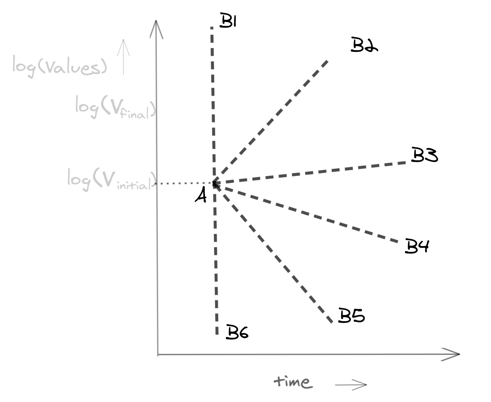

In the above image\(s\), the final value can be any one of $$B1$$, $$B2$$, $$...$$, $$B6$$. There are more possibilities - in fact, there are infinite possibilities between that semi-circle.

Can it go backwards? No. As in, the $$B$$point cannot have a lower X-axis value than $$A$$, since X-axis is time, and we cannot go back in time for final value of the asset.  
  
**Best case scenario** is depicted by the line starting at $$A$$and ending at $$B1$$. This line has a slope or tilt of $$\infty$$\(positive infinity\).

Plugging this in our formula, we get $$\log{(1 + \frac{r}{100})} = \infty $$. Which resolves to $$r$$ being an infinitely large positive value.

**Worst case scenario** is depicted by the line starting at $$A$$ and ending at $$B6$$. This line has a slope or tilt of $$-\infty$$\(negative infinity\). Similarly, plugging this in the equation, we get $$r$$ to be a very large negative value, approaching negative infinity.

Theoretical limits of CAGR can be any value between $$-\infty$$and $$\infty$$. Most of us wrongly assume, that annual compounded growth rate cannot be higher than 100%  p.a. or -100% p.a. As we just saw, it can be any real number.

What if the slope of the line is zero? A straight line in the semi-log plot, that's parallel to X-axis or the axis of time. In this case, $$r$$ would also be zero. In other words, if there's no net growth over a certain period of time \(starting and final value in Y-axis is same\), then CAGR of that asset price is zero over that period of time.

We can build on this.

A 100% p.a. return denotes price doubling every year. What would slope of this line even look like for a 100% p.a. CAGR? Plugging $$r = 100$$ in our above formula, we get slope to be $$\log{2}$$.

If the logarithm base is 10, then the angle of slope is effectively $$\tan^{-1}({\log_{10} 2})$$, or $$16^{\circ}$$. If the base of logarithm is $$e$$, then angle of slope is $$\tan^{-1}(\ln{2})$$, or $$34^{\circ}$$.

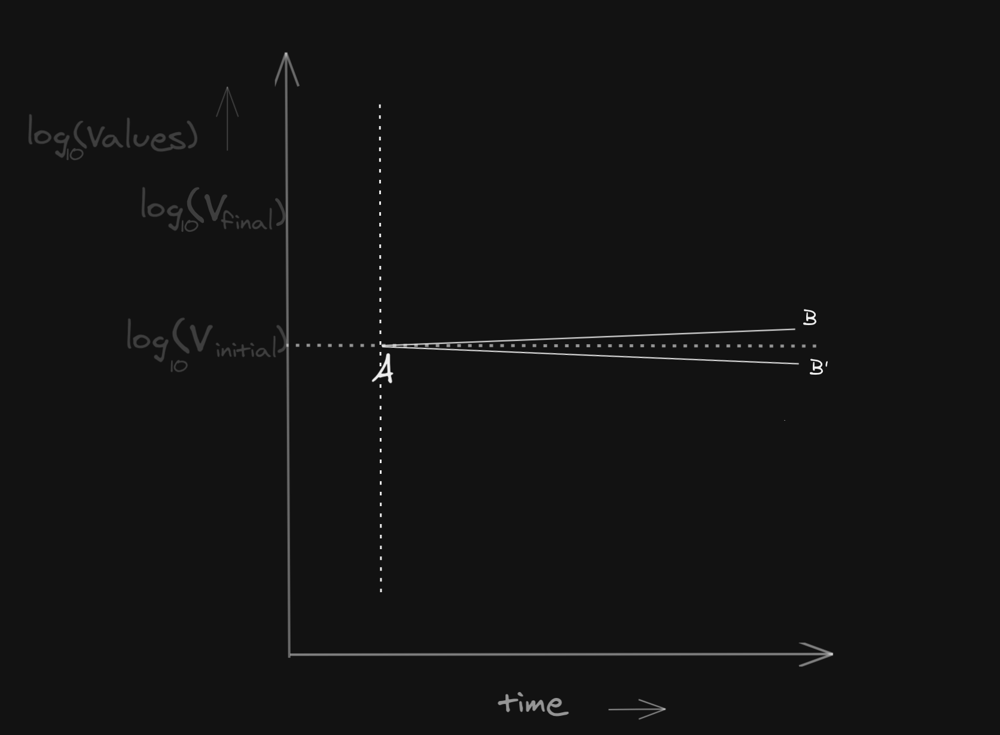

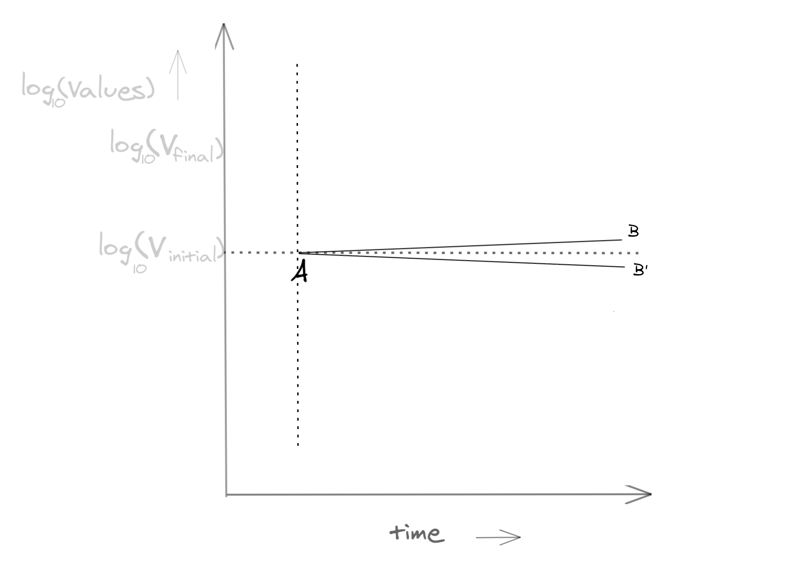

In a semi-log plot where prices are logarithm of base-10, the realistic expectation would look like this. Most start and end points would be between the angular area $$A$$ to $$B$$or  $$A$$ to $$B'$$, while other areas outside of this region would remain largely unreachable for most common assets.

## Recap and Wrapping Up

When it comes to spreadsheet / excel functionalities, in this chapter, we learned

* how to draw semi-log plots
* how to use `RRI()`

We have also gained new insights into a demystified process of _return calculation_.

The next time we see CAGR reported on any portal such as MoneyControl, ValueResearch Online, Morningstar, CRISIL, BSE India, Kuvera, Coin, PayTM Money, INDMoney, Piggy, ETMoney, or even Smallcase, we’d know how to compute and validate these numbers ourselves.  
  
These platforms and portals are computing these numbers from historic NAV data they have obtained and now we can compute the same as well.

#### A word of caution! 

CAGR is a point-to-point metric. Given any two points in a plane, a straight line can always be drawn to connect those two points. This is one of the fundamental axioms of geometry, known as one of the core axiom of _Axioms of Euclidean Plane Geometry._

It says nothing about the _journey_ or price-movement in-between.

For instance, the computation above might have painted a rosy picture, that one might falsely assume _Nifty can easily achieve 12.5%-14% p.a. return over a 3 year time period_.

**This is wrong, and dangerous to assume**.

The actual journey of Nifty 50 index between those two dates, can be viewed as this \(plotted using real Nifty price data, which can be obtained from Google Finance\). This is also a semi-log plot, where the price axis \(Y-axis\) is consisted of log values of actual asset prices.

As Nifty TRI and Nifty index fund move closely with Nifty 50 itself, plotting these would lead to similar looking graphs, with lot of volatility.

What we’re doing when we compute CAGR, is to connect the starting point and last point on the graph with a straight line, then compute slope of that line.

Since two points on a plane can be connected with so many different lines and line segments \(can even be curves\), there are infinite possibilities of the _journey within that time period_, which CAGR computation won’t capture.

We’ve alluded to this in one of our previous chapters, where we had computed NASDAQ-based portfolio’s final value. Although the point-to-point return of NASDAQ was near zero in that case, the actual returns in a DCA / SIP portfolio were different and didn’t show up as one would expect looking at point-to-point returns.

Similarly, CAGR alone cannot produce any information on the price movement of an asset within a time period.

In next chapter, we’d be introduced to a more generalized measure, that captures more relevant information.

