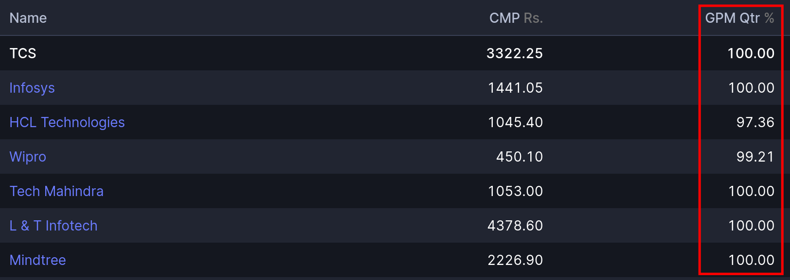
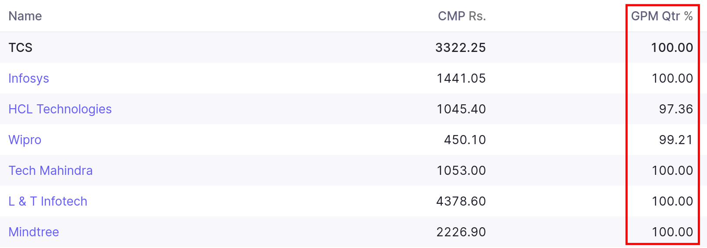
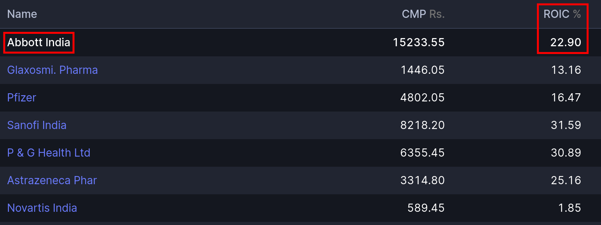
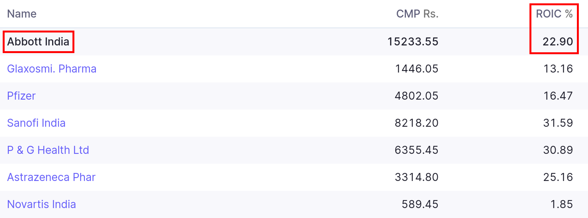

# Which screener\(s\) should I use?

## Introduction

Even though screeners are useful in finding out the investment opportunities which suits your criteria, it might not be a good idea to take a screener at its face value.

You might see an opportunity or a red-flag from these screeners. However, it could easily just be a calculation error, or usage of incorrect formula, or not removing an outlier.

This article is to sensitize you that you might have to do more research rather than just going with the presented data from the UI of a screener.

## Examples of incorrect data in screeners

We've come across some incorrect computations and results that are outright wrong. We've also informed the teams behind these screeners. At the time of writing this, these have not been addressed.  
  
It's our duty to warn others to be mindful of these, while they embark on their research.

Following are a few examples of such issues we'd noticed when we were doing this research into existing screeners.

### Gross Profit Margin

The Gross Profit Margin on screener.in for all IT companies, including Tata Consultancy Services \(TCS\), is either 100%, or close to 100%.

This basically implies that TCS has nearly ₹0 worth of expenses and all their sales is translated into gross profit.

For those who’re unfamiliar, gross profit is the operational sales of a company minus its COGS \(**C**ost **O**f **G**oods **S**old\).

Yeah, TCS doesn’t sell goods but it does have significant employee expenses. Since a services company like TCS doesn’t have goods in the traditional sense, we have to use their employee expenses to arrive at a meaningful gross profit margin figure.  
  
To say that gross profit margin of TCS is 100% is simply incorrect.

### Return on Capital Invested

ROIC \(**R**eturn **O**n **I**nvested **C**apital\) is also wildly incorrect on screener.in, and MorningStar India.  
  
Using Abbott India \(NSE: ABBOTINDIA\) as an example, the ROIC of Abbott India on screener.in is mentioned as 22.90%,but in reality, it is closer to 138%.

Note that the ROIC of Sanofi \(NSE: SANOFI\) is mentioned as 31.54% on screener but in reality, it is closer to 41%.

Although Abbott has a much higher ROIC than Sanofi, screener.in paints a different picture altogether. Calling it misleading wouldn’t be incorrect.

Morning Star seems to have made the same mistake.

On this one aspect, kudos to Tijori Finance for presenting a relatively correct calculation of ROIC for Abbott India.

### Some Causes of these inaccuracies

One of the components in the calculation of ROIC is Capital Invested and it excludes all non-operational assets that a company has. Cash and Cash Equivalents are generally not considered operational assets, but Screener.in and Morning Star don’t seem to consider this factor for some reason. Since they end up including Cash and Cash Equivalents in Capital Invested, ROIC is incorrectly penalized for companies with high amounts of cash on hand.

ROIC is also a bit hard to calculate and get right so this may have been another factor for inaccuracy. Some screeners don’t even include ROIC for this reason.

## Summary and Wrap-up

Every screener is bound to get inaccuracies whether it's screener.in, MorningStar, Tijori Finance, or some new entrant in this space.

Don’t rely on any of the ready-made screeners. Don’t trust the numbers you see on a screener that’s been prepared by someone else.

The next time you’re doing due diligence on a company, cross-check all calculations yourself. _****_

_**Trust, but verify.**_

To understand how to use a screener, you might want to check this out




We've reached out to some of the teams behind these screeners and have pointed out these issues. They've assured us that they're looking into this.


