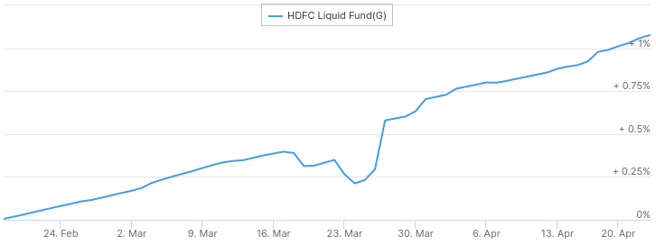
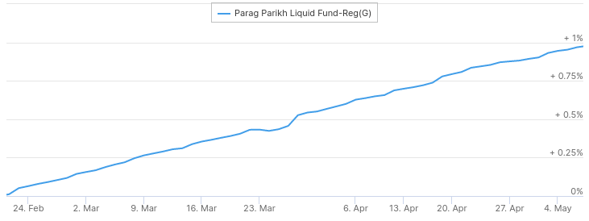

# Where can I park money for a few days, a few months, or a few years?

First of all, it should be clear what you mean when you say "park money". You intend to keep some money safe somewhere for a requirement that's going to come up in the near future \(somewhere between a few days to 1-2 years down the line\).

Let's start with the absolute basic thing you can do. **Nothing**. If you want to park money for a few days or a few months, you can keep it in your **savings bank account** which, as of Jan 2021, would yield anywhere from 2.7% to 3.5% in too big to fail banks like SBI, HDFC, and ICICI. Axis Bank and Kotak Mahindra Bank are offering upto 4%.

You can also park your money in a high yield savings account such as the IDFC First Bank savings account which is offering 6% interest on less than ₹1 crore deposit. However, this abnormal interest rate isn't gonna last forever. Until 31st Jan 2021, they were offering 7% interest in their savings account. IDFC First is improving their CASA ratio from retail deposits. Once they achieve their targets, they'll likely slash their interest rates further. For more details, check out [page 42 of the Q3 FY21 investor presentation](https://www.idfcfirstbank.com/content/dam/IDFCFirstBank/invester-relation/Financial-Results/2020/IDFC-FIRST-Bank-Investor-Presentation-Q3-FY21-new.pdf) from IDFC First Bank.

As a thumb rule, avoid co-operative banks and small finance banks. Although DICGC insures your deposits in a bank account up to ₹5 lakh, it's better not to rely on it and take unnecessary risks.

Check out below links if you want to know how to evaluate the health and safety of banks in India.

* [How to see if a bank is risky for placing your deposits? \[A guide from a banker\]](https://web.archive.org/web/20210130165611/https://old.reddit.com/r/IndiaInvestments/comments/jwesme/how_to_see_if_a_bank_is_risky_for_placing_your/)
* [Indian \[private\] Banks - Health scorecard](https://web.archive.org/web/20210130165616/https://old.reddit.com/r/IndiaInvestments/comments/k0q2pb/indian_private_banks_health_scorecard/)

You can get a deduction of ₹10,000 on earnings generated from interest in savings bank accounts under Section 80TTA. Senior citizens get a deduction of ₹50,000 under Section 80TTB and this includes interest earned from savings bank accounts as well as bank fixed deposits.

The second natural choice for most people should be **bank fixed deposits** which have reasonable liquidity and safety for parking money. As of January 2021, most big banks are offering anywhere between 4.9% to 5.5% interest rates on FDs. However, unlike bank accounts which are tax-exempt if the interest amount is less than ₹10,000, all interest income from a fixed deposit is taxable. The bank will auto deduct TDS @ 10% if your interest income from FDs exceed ₹40,000. You’ll have to pay any additional taxes later if you fall under income tax slabs higher than 10%.

You can also park your money in certain debt mutual funds. This includes **overnight funds** and **liquid funds** for parking money for a few months and **money market funds** for a few years. However, note that unlike savings account and fixed deposits, debt mutual funds are _marked to market_ which means that you should expect some volatility in day to day NAV. This volatility is mostly negligible in overnight and liquid funds but we have seen events like the Covid 19 crash in March 2020 when even liquid funds experienced a few days of relatively high volatility.

Here are the NAV graphs of HDFC Liquid fund, the biggest liquid fund in India in terms of AUM, and Parag Parikh Liquid fund during the covid crisis.

That being said, investments in debt funds don’t incur TDS or taxes until you redeem money from them. Many liquid funds also offer instant redemption up to ₹50,000 at any time of the day although the reliability of the instant redemption depends on the AMC website.

As an example, ₹1 lakh kept for 1 year in IDFC First savings bank account at 6% interest would give you ₹6,000. If you keep it in a savings bank account in big banks like SBI, HDFC, and ICICI, you'll get anywhere from ₹2,700 to ₹3,500. This interest income would be tax-free \(since it's less than ₹10,000\). A bank fixed deposit might give you anywhere from ₹4,991 to ₹5,875 and you'd have to pay taxes on it. Assuming a CAGR of 3%, a liquid fund would give you approximately ₹3,000 which is taxable but only when you redeem it.

Last, but not least, there are **arbitrage funds**. These debt MFs are taxed like equity MFs so you don’t have to pay any taxes if you park your money for more than a year and your gains during redemption don’t exceed ₹1 lakh. This might sound good on paper but arbitrage funds are significantly more volatile than liquid funds and don’t offer instant redemptions either. The returns from arbitrage funds also depend on the availability of arbitrage opportunities and this has started to come into question. For more details, check out this [article](https://web.archive.org/web/20201130085545/https://www.capitalmind.in/2020/06/arbitrage-funds-you-dont-want-to-be-the-elephant-in-the-room/).

At the end of the day, when it comes to parking money in arbitrage funds, buyer beware.

Now that we've covered where you can park your money, we'll list some instruments **where you probably shouldn't park money** for planned redemption in the near future.

* Any debt mutual fund with somewhat significant interest rate or credit risk. This includes credit risk funds, dynamic bond funds, gilt funds, banking & PSU funds, ultra short, short, low, medium, and long duration funds, and corporate debt funds.
* Hybrid mutual funds
* Index funds like UTI Nifty index fund
* Any other sort of equity mutual fund
* Stocks

