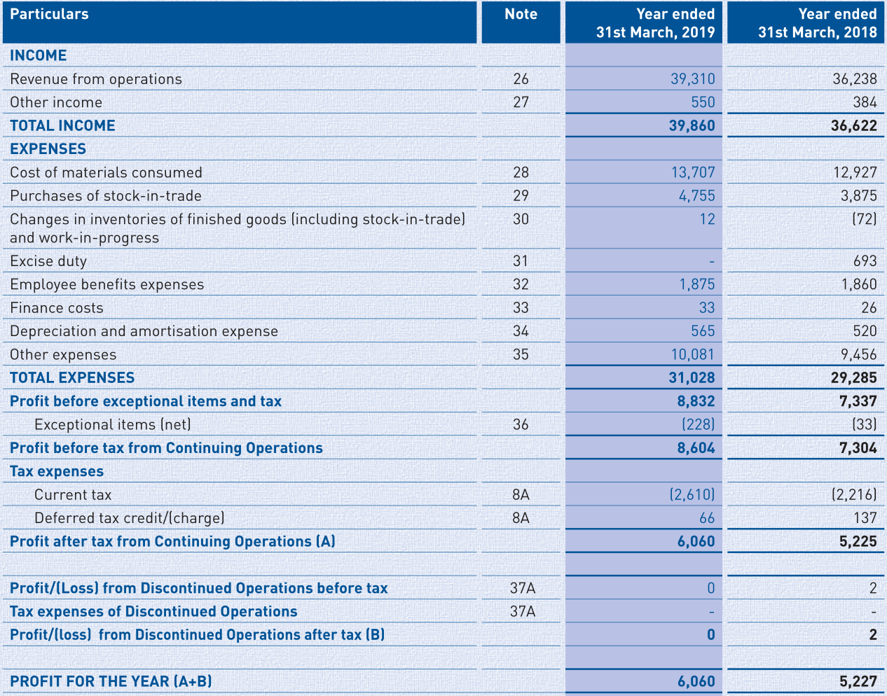
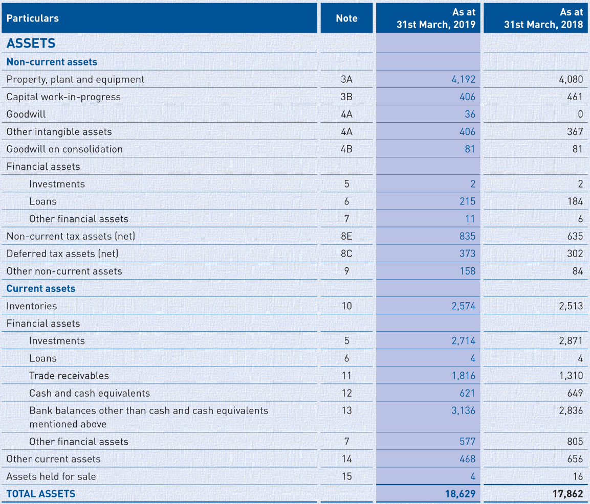

# Efficiency

### Asset Turnover Ratios

One of the most basic operational aspects of a business is generating sales using its assets. We can measure the efficiency of this operational aspect using the **asset turnover ratio** which can be defined as

```text
Asset Turnover Ratio = Total Income / Average Assets
```

We’ll consider the average of the total assets during a financial year to account for potentially abrupt changes in total assets due to unusual events like sales of fixed assets, increase in goodwill etc.

Asset Turnover Ratio is one of the components in the DuPont Identity we used to calculate the Return on Equity in the [Profitability section](https://indiainvestments.gitbook.io/content/stocks/financial-metrics-and-ratios/profitability#return-on-equity-roe-and-return-on-assets-roa).

As we’ve mentioned before, it wouldn’t make sense to compare ratios between companies in different sectors. FMCG companies usually enjoy high asset turnover while asset heavy companies and financial institutions don’t.





The total income of Hindustan Unilever Ltd for the year 2019 is `₹39,860 crores` and the average total assets are `(₹18,629 + ₹17,862)/2 = ₹18,245.5 crores`. The asset turnover ratio of Hindustan Unilever for the year 2019 is `₹39,860 / ₹18,245 = 2.18`. In contrast, the asset turnover ratio of Nestle India for the year 2019 is `1.66`. If we observe the past 5 year trend, Hindustan Unilever has had an asset turnover ratio of greater than 2 while Nestle India has had an asset turnover ratio of greater than 1 but less than 2. Using this information, we can infer that Hindustan Unilever is _possibly_ more efficient at generating revenue from its assets than Nestle India.

The asset turnover ratio of a company can get skewed due to a number of unusual events such as asset sales, issue of additional shares, investment into assets for long term growth, deliberately increasing inventory to meet demand etc. It’s best if we look at a trend of how asset turnover ratio has been in the past 5 years before jumping to conclusions. Let’s consider the financial statements of Avenue Supermarts for the year 2020.


The asset turnover ratio of Avenue Supermarts for the year 2019 is `3.16`. However, due to issue of additional shares and the investment of the capital gained into non-current financial assets, the asset turnover ratio drops to `2.61` in the financial year 2020.

Although we’ve seen what asset turnover ratio is, we can go ahead and refine it further to get a more useful metric. Instead of considering total assets, we’ll now consider only the non-current, or fixed, assets of a company to calculate the **Fixed Asset Turnover Ratio**. Why not consider the current assets? Well, most companies and sectors where asset turnover ratios are relevant often invest in long term assets to generate sales. We’ll focus on current assets in the working capital and cash conversion cycle.

We can define fixed asset turnover ratio as

```text
Fixed Asset Turnover Ratio = Total Income / Average Non Current Assets
```

The fixed asset turnover ratio of Hindustan Unilever Ltd for the year 2019 is `₹39,860 / ((₹6,715 + ₹6,202) / 2) = 6.17` while that of Nestle India for the year 2019 is `3.82`.

### Inventory Turnover, Receivables Turnover, and Payables Turnover

### Inventory Days, Days Receivable, Days Payable \(DSI, DSO, DPO\)

### Cash Conversion Cycle

### Working Capital

